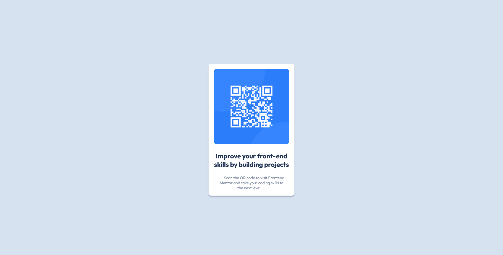

# Frontend Mentor - QR code component solution

This is a solution to the [QR code component challenge on Frontend Mentor](https://www.frontendmentor.io/challenges/qr-code-component-iux_sIO_H). Frontend Mentor challenges help you improve your coding skills by building realistic projects. 

## Table of contents

- [Overview](#overview)
  - [Screenshot](#screenshot)
  - [Links](#links)
- [My process](#my-process)
  - [Built with](#built-with)
  <!--- [What I learned](#what-i-learned) -->
  <!--- [Useful resources](#useful-resources) -->
- [Author](#author)
<!--- [Acknowledgments](#acknowledgments)-->

## Overview

### Screenshot

### Links

- Solution URL: [solution URL here](https://www.frontendmentor.io/solutions/qr-code-component-l7noySVjdW)
- Live Site URL: [live site URL here](https://ruchdane-qr-code-component.netlify.app/)

## My process

### Built with

- Semantic HTML5 markup
- CSS custom properties
- Flexbox

<!--### What I learned-->

<!-- ### Continued development -->

<!-- ### Useful resources

- [Example resource 1](https://www.example.com) - This helped me for XYZ reason. I really liked this pattern and will use it going forward.
- [Example resource 2](https://www.example.com) - This is an amazing article which helped me finally understand XYZ. I'd recommend it to anyone still learning this concept.
-->
## Author

<!-- - Website - [Add your name here](https://www.your-site.com) -->
- Frontend Mentor - [@yourusername](https://www.frontendmentor.io/profile/Ruchdane)
<!-- - Twitter - [@yourusername](https://www.twitter.com/yourusername) -->

<!-- ## Acknowledgments-->